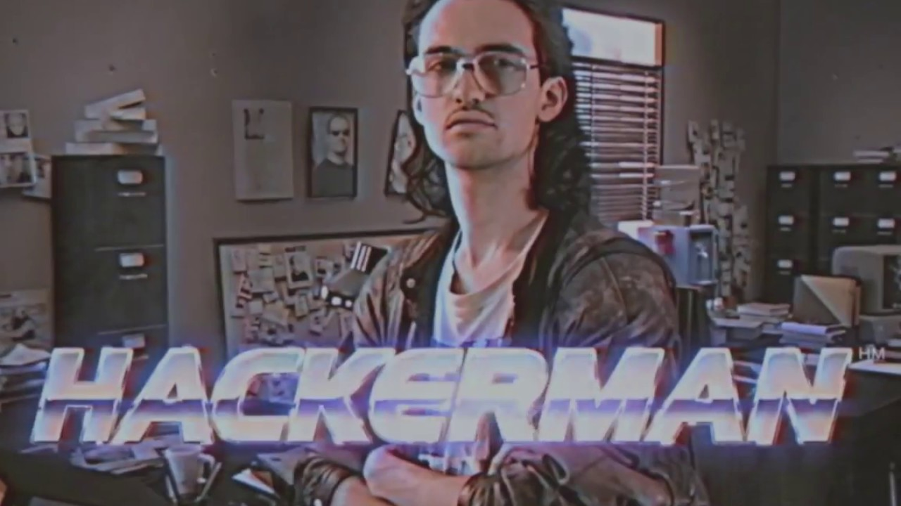
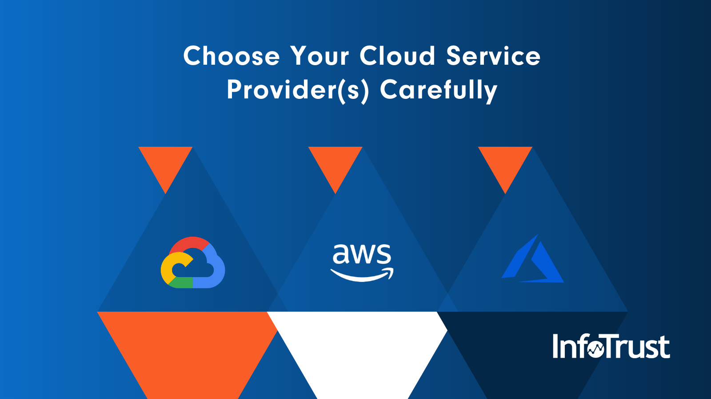
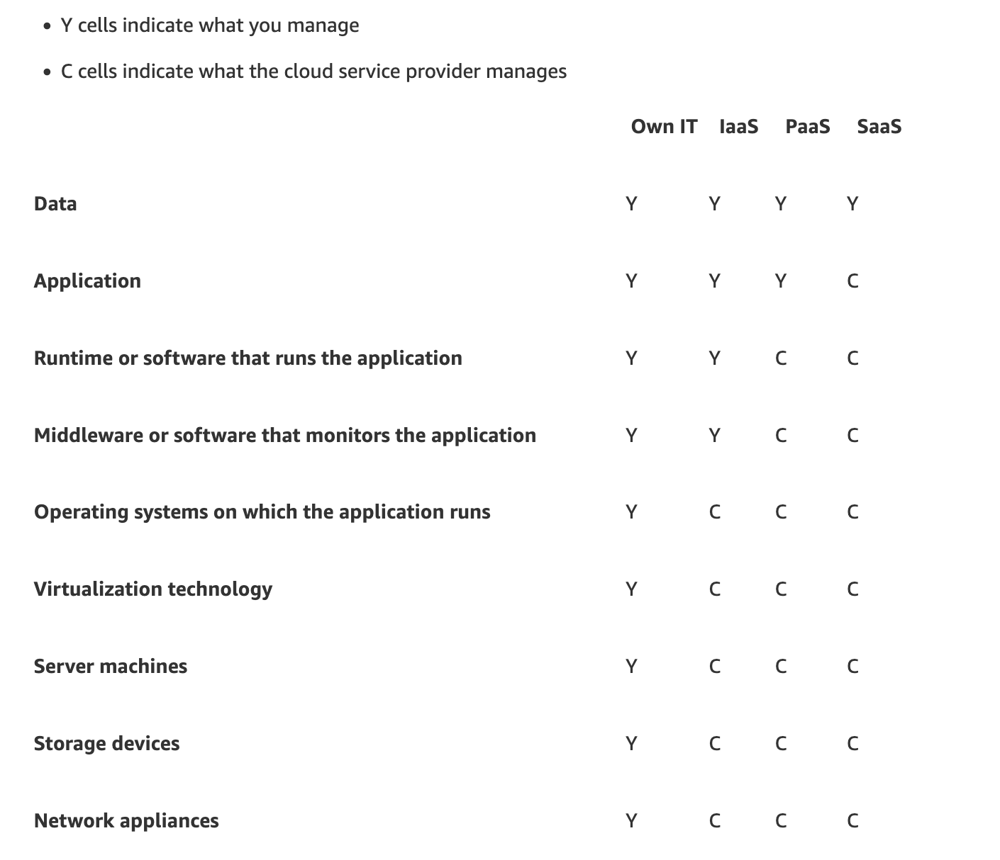
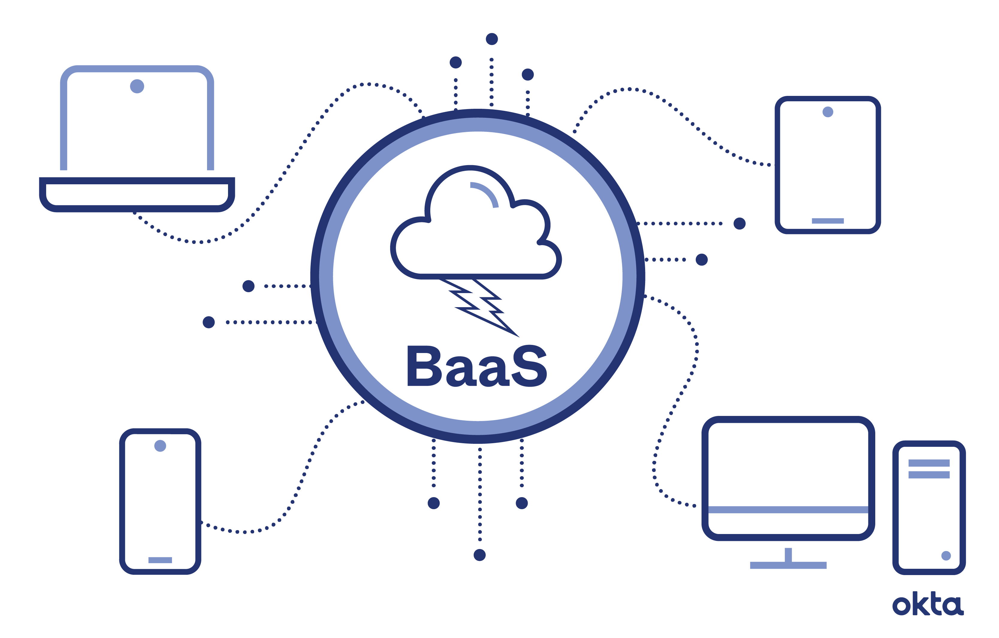
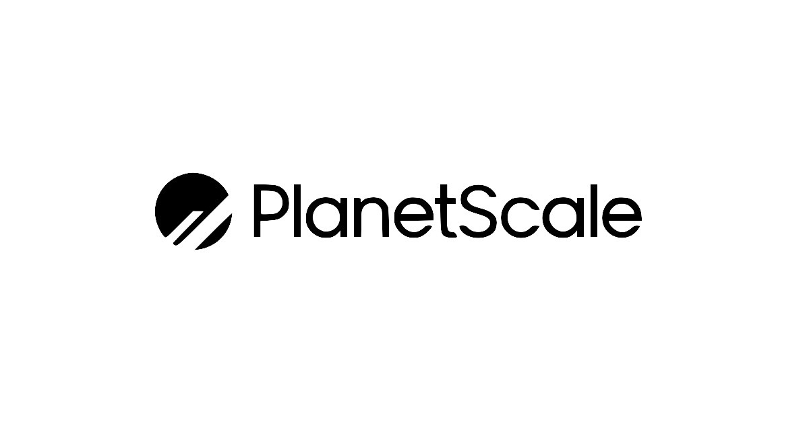
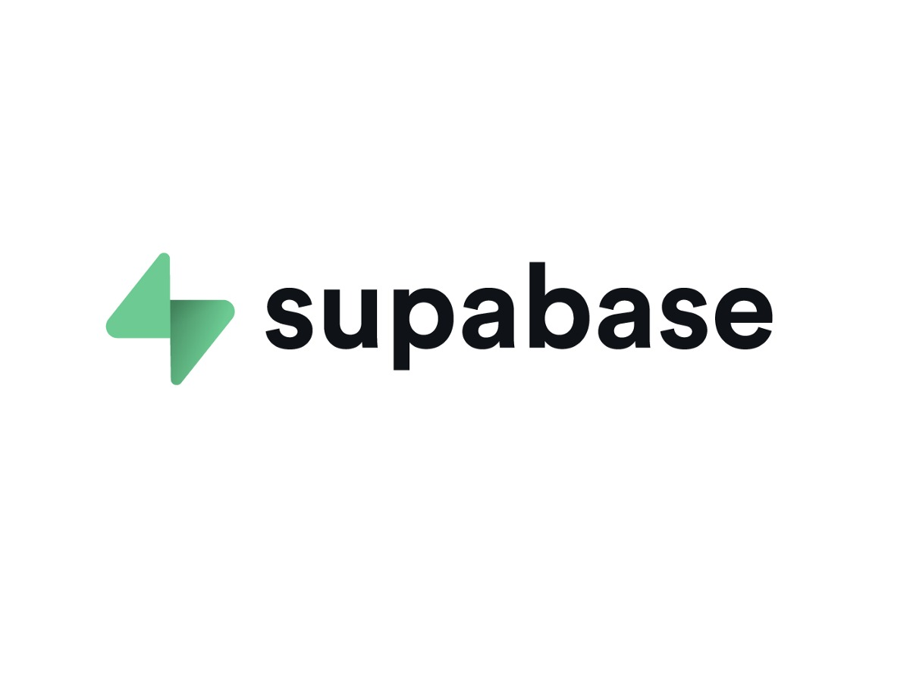
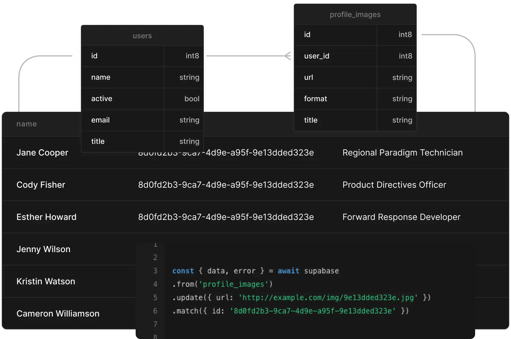
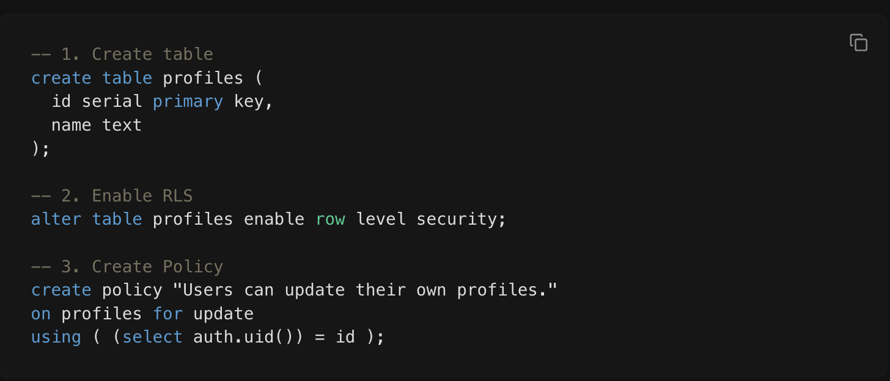
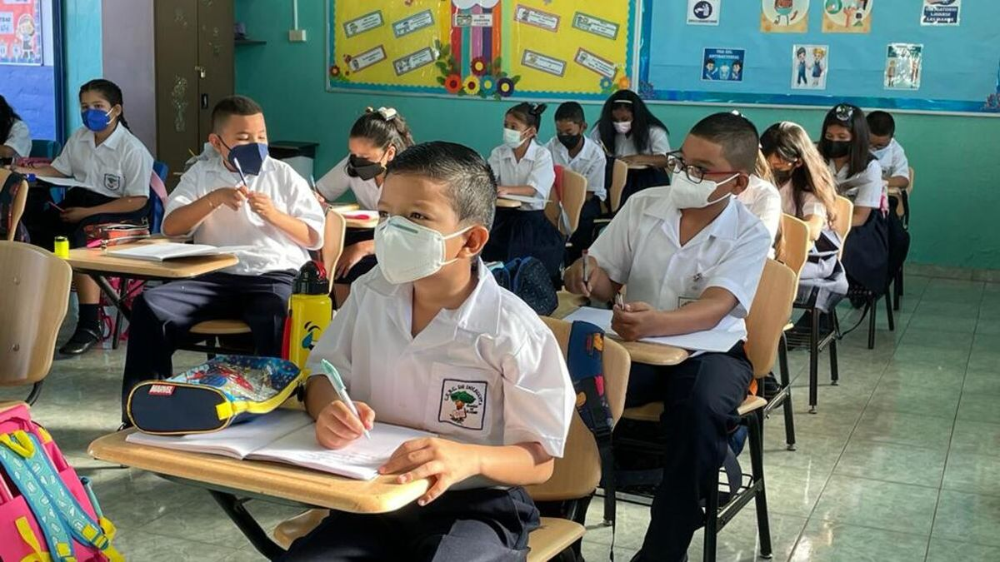
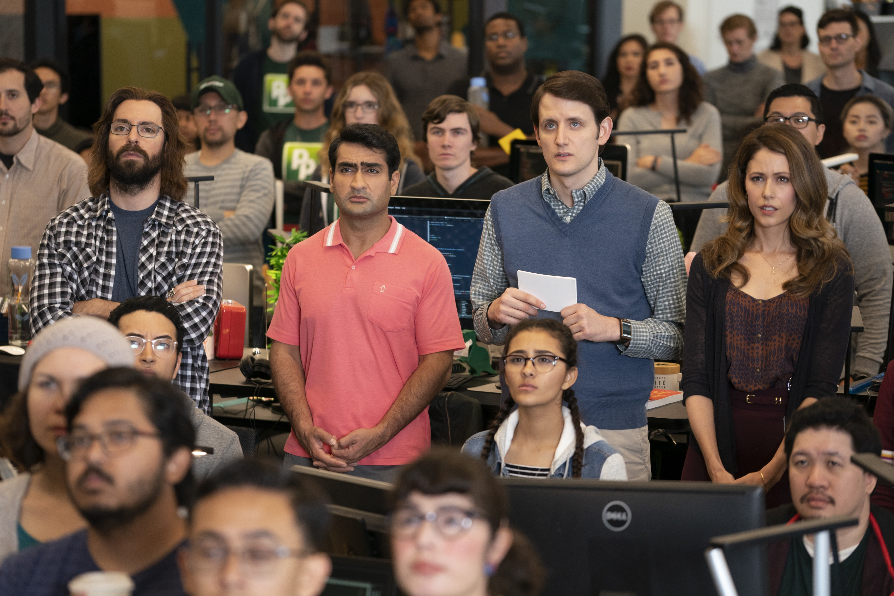

---
transition: fade-out
layout: two-cols
layoutClass: gap-16
---

# Backend as a service - Una introduccion rapida a Supabase

[Linkedin](www.linkedin.com/in/azael-fernandez) · [GitHub](https://github.com/kasec/backend-as-a-service_talk) · [Tribu.dev](https://www.tribu.dev)

Azael Fernandez @ 2025

---
transition: slide-up
layout: image
layoutClass: text-center
---
# Old school

---
transition: slide-up
layout: image
layoutClass: text-center
---

# Cloud Providers

---
layout: image

---

# Tipos de Cloud Computing

---
transition: slide-up
layout: center
layoutClass: gap-16
---

---
layout: center
---

# Backend as a service

1. Que es backend?
2. Que es un frontend developer?

---
layout: center
class: text-center
---

# Backend as a service

  
   
  
   
  

---
layout: two-cols
---

# Porque Supabase?

- Documentacion
- Comunidad
- Open source
- Opcion gratuita

## Modulos

- Autenticacion
- Base de datos
- Almacenamiento

::right::

---
layout: two-cols
class: text-center
---

::right::

---
layout: center
class: text-center
---

# Gracias!

[Linkedin](www.linkedin.com/in/azael-fernandez) · [GitHub](https://github.com/kasec/backend-as-a-service_talk) · [Tribu.dev](https://www.tribu.dev)

Azael Fernandez @ 2025

---
layout: center
---

# Fuentes

- [amazon/what-is/iaas](https://aws.amazon.com/what-is/iaas/)
- [supabase.com/database](https://supabase.com/database)
- [postgres/row-level-security](https://supabase.com/docs/guides/database/postgres/row-level-security) 

---

